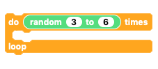

## Multiple sequences

Things are getting more complex as we go but we have still not written a program containing more than one sequence.

Let's try putting two sequences together!

We'll start off with your slow move sequence from the last section.

--- task ---

If it's not already open, get or rebuild the code from the 'slow moves' section.

--- /task ---

--- task ---

Move the end block that turns the `servo OFF`{:class="crumbleinputoutput"} away from the code and leave it to one side.

--- /task ---

--- task ---

Adjust the 'slow moves' sequence by changing the `delay`{:class="crumblevariables"} to 40 and the number of `repeats`{:class="crumblecontrol"} to 30. This means it will move a little quicker and will only open a third of the amount it did before.

NOTE: Remember that there are two `repeat`{:class="crumblecontrol"} values to change!

--- /task ---

So we already have one sequence in place and we just need to add a separate, different sequence below it.

I'm going to add a full speed, random delay sequence similar to one you coded earlier but you could make up a different sequence you like.

--- task ---

Get a new `repeat loop`{:class="crumblecontrol"} and set it to repeat `3 to 6`{:class="crumbleoperators"} times.

--- /task ---

--- task ---

Inside the new `repeat loop`{:class="crumblecontrol"}, set `servo A`{:class="crumbleinputoutput"} to `open`{:class="crumblevariables"} and then `wait`{:class="crumblecontrol"} for `50 to 400`{:class="crumbleoperators"} milliseconds.

--- /task ---

Since the `wait`{:class="crumblecontrol"} is only `3 to 6`{:class="crumbleoperators"} milliseconds, it is unlikely that the servo will have time to reach the `open`{:class="crumblevariables"} position. The shorter the random value, the smaller the angle of rotation andthe quicker the movement appears.

--- task ---

Duplicate the last two blocks and change the `open`{:class="crumblevariables"} to `closed`{:class="crumblevariables"}.

Add the duplicated blocks to the `loop`{:class="crumblecontrol"}.

--- /task ---

You could just put the two sequences together but let's take it a step further and repeat both sequences.

--- task ---

Take the first 'slow moves' sequence, pull it away from the main code and stick it on top of the second sequence that you have just coded.

--- /task ---

--- task ---

Get another `do 10 times loop`{:class="crumblecontrol"}, change the number of repeats to 3 and put the combined sequences inside the new `loop`{:class="crumblecontrol"}.

--- /task ---

--- task ---

Lastly, join the new `repeat loop`{:class="crumblecontrol"} to the main body of code and add the final `servo A OFF`{:class="crumbleinputoutput"} block to the end.

--- /task ---

Click the **play** button to run the code.

--- no-print ---

--- /no-print ---

--- print-only ---

--- /print-only ---