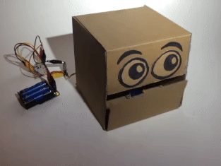
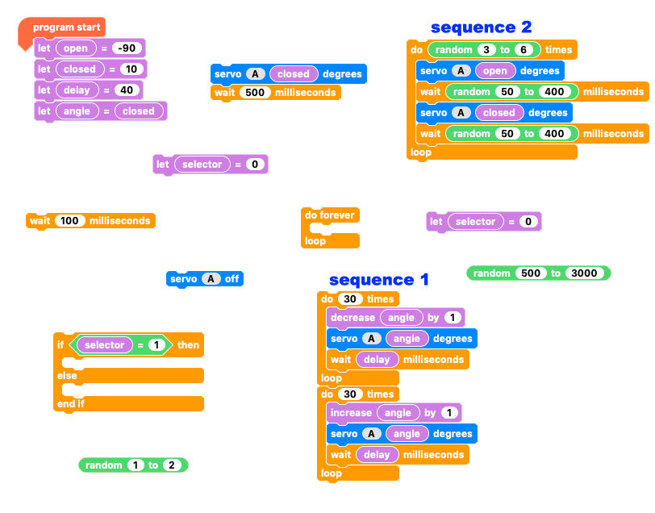
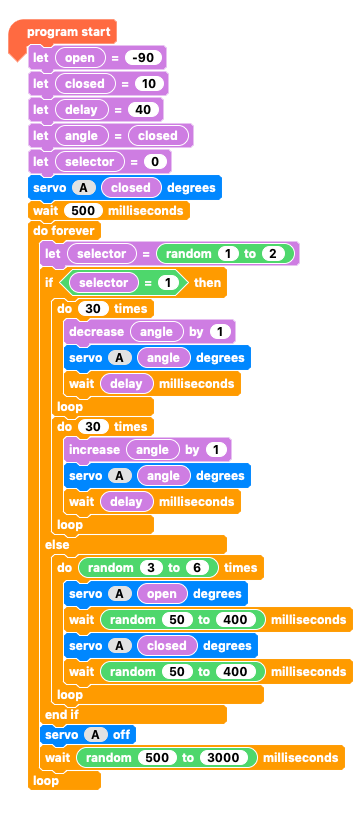

## Challenge: random sequence selector

You have already coded your robot mouth to open and close with two different sequences but currently they still run in a predictable, set order.

Can you add code to your 'multiple sequence' program to:

+ Randomly select one sequence to execute?
+ Wait between 1/2 to 2 seconds before selecting another random sequence?
+ Repeat until the programis stopped?

NOTE: Don't start from the beginning, just alter the code you have written for the multiple sequences. What happens in the sequences is not important for this challenge. This is all about randomly selecting a sequence.

--- no-print ---

--- /no-print ---

--- print-only ---

--- /print-only ---

--- hints ---

--- hint ---

When the `program starts`{:class="crumblebasic"}, you should:
+ `Set the variable value`{:class="crumblevariables"} of `open`{:class="crumblevariables"}, `closed`{:class="crumblevariables"},`delay`{:class="crumblevariables"} and `angle`{:class="crumblevariables"} as you did previously.
+ `Add a new variable`{:class="crumblevariables"} called `selector`{:class="crumblevariables"} and set its value to 0.
+ Set `servo A`{:class="crumbleinputoutput"} to `closed`{:class="crumblevariables"}
+ `Wait`{:class="crumblecontrol"} for half a second
+ `Repeat forever`{:class="crumblecontrol"} t
    + Set `servo A`{:class="crumbleinputoutput"} to `open`{:class="crumblevariables"}
+ `Wait`{:class="crumblecontrol"} for `100 to 400`{:class="crumbleoperators"} milliseconds
+ Set `servo A`{:class="crumbleinputoutput"} to `closed`{:class="crumblevariables"}
+ `Wait`{:class="crumblecontrol"} for another `100 to 400`{:class="crumbleoperators"} milliseconds
+ Finally, after the `repeat loop`{:class="crumblecontrol"}, turn `servo A OFF`{:class="crumbleinputoutput"}

Most of the code is the same as before. You will need to remove some `variable`{:class="crumblevariables"} blocks and add a few `random number`{:class="crumbleoperators"} blocks.

--- /hint ---

--- hint ---

You will need to remove the `delay variable`{:class="crumblevariables"} blocks and add the `random number`{:class="crumbleoperators"} blocks.

--- /hint ---

--- hint ---

The code below works for my robot head's mouth. You will probably have different `open`{:class="crumblevariables"} and `closed`{:class="crumblevariables"} angles. The range of `random numbers`{:class="crumbleoperators"} you choose for your robot is also dependent on your robot and your choice.

Click the green **Play** button to see if it works.

--- /hint ---

--- /hints ---