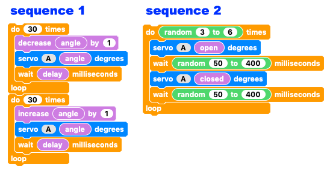
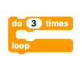

## Challenge: random sequence selector

You have already coded your robot mouth to open and close with two different sequences but currently they still run in a predictable, set order.

Can you add code to your 'multiple sequence' program to:

+ Randomly select one sequence to execute?
+ Wait between 1/2 to 3 seconds before selecting another random sequence?
+ Repeat until the program is stopped?

NOTE: Don't start from the beginning, just alter the code you have written for the multiple sequences. What happens in the sequences is not important for this challenge. This is all about randomly selecting a sequence.

--- no-print ---

--- /no-print ---

--- hints ---

--- hint ---

When the `program starts`{:class="crumblebasic"}, you should:
+ `Set the variable value`{:class="crumblevariables"} of `open`{:class="crumblevariables"}, `closed`{:class="crumblevariables"},`delay`{:class="crumblevariables"} and `angle`{:class="crumblevariables"} as you did previously.
+ `Add a new variable`{:class="crumblevariables"} called `selector`{:class="crumblevariables"} and set its value to 0.
+ Set `servo A`{:class="crumbleinputoutput"} to `closed`{:class="crumblevariables"}
+ `Wait`{:class="crumblecontrol"} for half a second
+ `Repeat forever:`{:class="crumblecontrol"} 
    + Set `selector`{:class="crumblevariables"} to `1 to 2`{:class="crumbleoperators"}
    + `If`{:class="crumblecontrol"} `selector`{:class="crumblevariables"} `= 1`{:class="crumbleoperators"} `then:`{:class="crumblecontrol"}
        + Run sequence one
    + `Else`{:class="crumblecontrol"}
        + Run sequence two
    + Turn the `servo OFF`{:class="crumbleinputoutput"}
    + And `wait`{:class="crumblecontrol"} between `500 to 3000`{:class="crumbleoperators"} milliseconds

Most of the code is the same as before. You will need to add the `selector`{:class="crumblevariables"} variable, a `do forever`{:class="crumblecontrol"} loop, and add a few `random number`{:class="crumbleoperators"} blocks.

--- /hint ---

--- hint ---

The only block you will need to remove is the `repeat`{:class="crumblecontrol"} that holds both of the sequences inside it.

Some exising blocks will need rearranging as well as new blocks being added.

--- /hint ---

--- hint ---

Here's what the completed code should look like.

You can play around with what the sequences are as much as you like.

How about adding a third sequence?

Click the green **play** button to see if it works.

--- /hint ---

--- /hints ---
