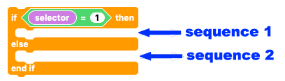
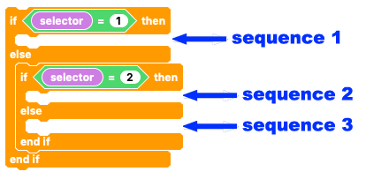
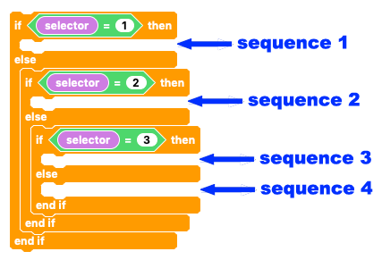

## What next?

Building on the last challenge, you could make whole range of sequences, randimise them and randoimise which one is selected.

We used the **IF... THEN... ELSE...** to choose between two different options

For three options we simply change this to **IF... THEN... ELSE IF... THEN... ELSE...**

And we can keep adding selection blocks to add to the number of possible options.

So that's all for Crumbles and servos for now.

Have you completed all of our [Crumble projects](https://projects.raspberrypi.org/en/projects?software%5B%5D=crumble){:target="_blank"}?

If you have, you could take a look at some of our other [robotics projects](https://projects.raspberrypi.org/en/projects/?interests[]=robotics){:target="_blank"}.