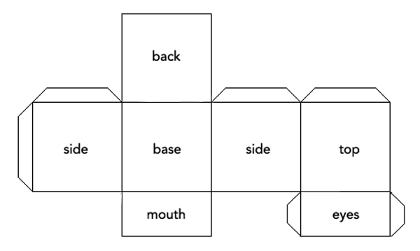
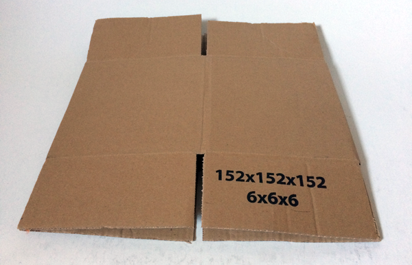
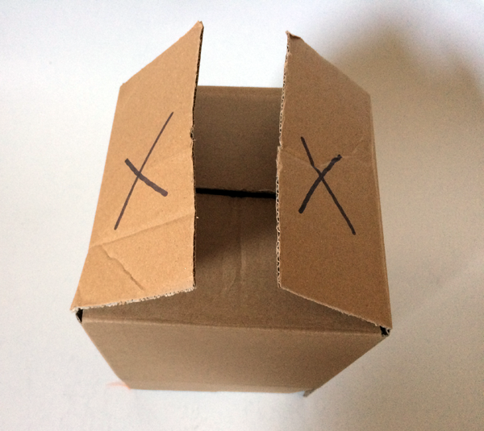
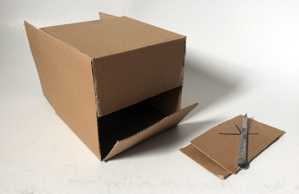
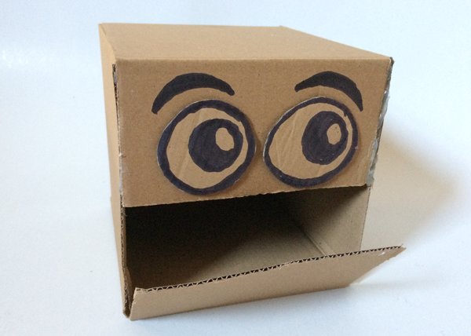

## The robot head

The first step is to make your robot head. You can use a small cardboard box or make a box shape from flat cardboard, using a 3D shape net.

Making a 3D net from scratch is great, but it can be time-consuming. There is no right or wrong way to make your robot head. If you want to focus on the mechanism and coding, buying a small box is a cheap and easy option. 

This example project uses a 6-inch wide cube box.

--- task ---

Decide where the face will be on your box and mark the two side flaps to be cut off.

--- /task ---

--- task ---

Use a knife or scissors to cut off the two side flaps.

Tape or glue the top flap down. This will be the face above the mouth.

--- /task ---

Closing the back opening of the box helps it keep its shape at this point. However, some people find keeping it open makes the rest of the build easier.

--- task ---

Make eyes for your robot head. You can draw or paint eyes onto the box or use cut up card, paper, or anything you like. After all, it's your robot head!

--- /task ---

