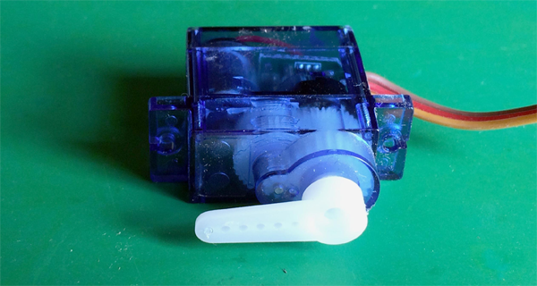

## Prepare the servo

Let's have a look at the servo and some important preparations to make before you use it in the project.

--- task ---

Servos have detachable plastic arms, called 'horns', these are fixed to the rotating shaft. The horns come in a variety of shapes for different uses. Most servos come with a small bag of different horns.

Select the horn that has a single long arm. If there are no single arm horns, you need to adapt another horn by cutting off any additional arms.

Place the horn on the rotating shaft.

--- /task ---

--- task ---

Test the range of the servo by gently moving the horn to its limit in each direction. Don't force it.

The servo arm can rotate past the flat position in one direction, but not reach the flat position in the other.

When the servo is lying flat on its side, you want the horn to rotate freely from horizontal 'flat' on one side...

And rotate freely 180° to horizontal on the other side without being able to go beyond these positions, as it would start hitting the inside of your box.

--- /task ---

--- task ---

If you are very lucky, you may get this right first time. If not, simply adjust it:

+ Rotate the horn to its full extent in one direction
+ Remove the horn from the rotating shaft
+ Replace the horn to the intended position at full rotation in that direction

Place the servo on its side and check that you did this right by checking its full rotation points again.

--- no-print ---

Your servo should rotate from horizontal to horizontal on each side.

--- /no-print ---

--- print-only ---

--- /print-only ---

--- /task ---

--- task ---

As well as a selection of horns, servos also come with screws to fix the horns. These prevent the horns from falling off when the servo rotates.

Once the horn is exactly where you want it, screw it in place.

Note: Once the servo becomes fixed inside your project, it is very hard to get to this fixing screw.

--- /task ---

Now that the horn is fixed in the correct rotation position, you are ready to make the pushrod mechanism.
