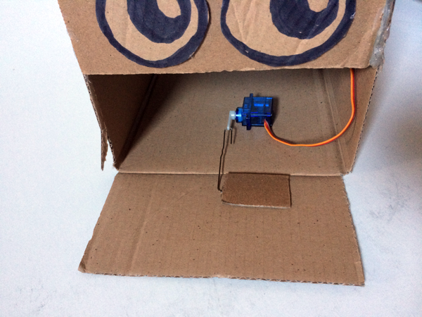

## The pushrod mechanism

You're going to use the servo and a paperclip to make a pushrod that will open and close the cardboard flap mouth of your robot head.

--- task ---

Get a paperclip and unbend it so that you have a 180° loop at one end and a 90° bend at the other.

--- no-print ---

Your servo should rotate from horizontal to horizontal on each side.

--- /no-print ---

--- print-only ---

--- /print-only ---

--- /task ---

--- task ---

Thread the loop end of your paperclip pushrod through the end small hole in the servo's horn.

--- /task ---

--- task ---

Before you fix your pushrod mechanism into the robot head box, you will need a small rectngle of cardboard to fix the 90° bent clip down to the inside of your robot mouth. A piece roughly 2cm x 3cm will be fine.

--- /task ---

The positions of the servo and the end of the pushrod are important so it's best if you understand where they need to go.

The measurements will be different depending on how long your paperclip pushrod is and the length of the servo horn but the principle will stay the same.

Work out where the end of the pushrod goes first:
+ The nearer the bottom of your robot head the pushrod end goes, the more movement the mouth will be capable of but the harder the servo will need to work.

Once the pushrod end is inplace you need to find the right distance for the servo.
+ When the mouth is fully open, the servo arm should be almost fully rotated towards the front of the box.

If it all goes wrong, we can always pull the bits off and try again. Let's give it a go!

--- task ---

Have the servo arm extended forward and flat and lay the end of the pushrod near the bas of the open mouth.

Notice that the pushrod arm is running down the middle of the box and open mouth. It works best in the middle!

--- /task ---

--- task ---

Now glue the cardboard tab over the bent pushrod arm making sure you don't cover the 90° bend.

Note: The 90° bend must be able to move freely!

--- /task ---

--- task ---

Check the servo position. The mouth should be fully open and the servo horn arm extended fully forwards.

This is the position that the servo needs to be glued in.

--- /task ---

--- task ---

Glue the servo in position so that the arm can move backwards and forwards, roughly in line with the centre of the box. Hot melt glue is aneasy way to do this and the glue will come offthe servo if you decide to remove it later.

--- /task ---

It is easiest to test whether the position is right by writing some code to move the servo but you can test it manually by reaching in through the back of the robot head and moving the servo arm by hand. Be careful if you do this as it is easy to move the servo or bend the pushrod.

