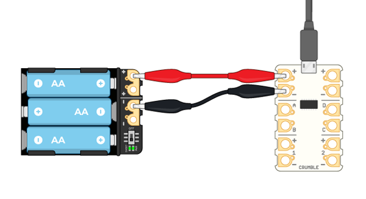
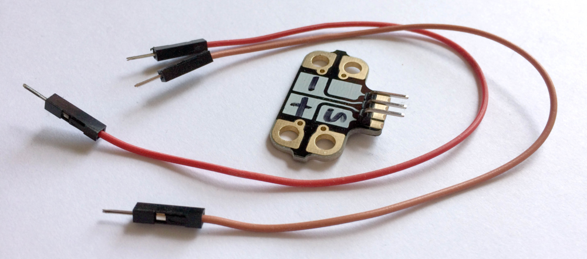

## Wire servo to Crumble

Now that you have your robot head, you need to wire up the servo to your Crumble controller board.

--- task ---

Connect your Crumble board to a computer using a micro USB cable, and to a battery pack using crocodile clip cables.

--- /task ---

--- task ---

To connect the servo to your Crumbliser, you can use either [Crumblisers](https://redfernelectronics.co.uk/product/crumbliser-pack-of-5/){:target="_blank"} or male-to-male jumper cables.

If you have Crumblisers available then this is by far the easiest way to connect your servo and Crumble together.

[[[servo-to-crumble-using-crumblisers]]]

Otherwise, three male-to-male jumper cables will do the same job, but be careful to keep any exposed wires or clips from touching each other.

[[[servo-to-crumble-using-jumper-cables]]]

--- /task ---

