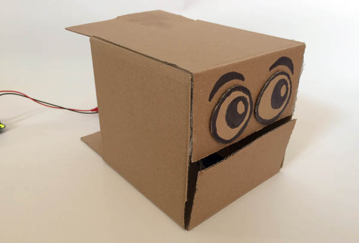
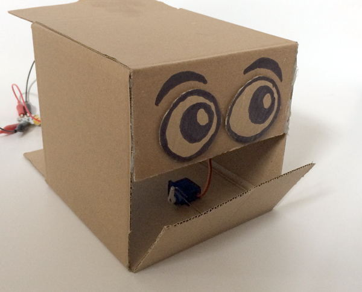

## Find the servo angles for open and closed

The first thing you need to do is to find the angle at which the servo holds the mouth open and closed.

We'll start by making `variables`{:class="crumblevariables"} for 'open' and 'closed'. This is not totally necessary but will help to keep our code clear.

--- task ---

Open the Crumble software and in the `Variables`{:class="crumblevariables"} section, click `Add New Variable`{:class="crumblevariables"}. Name the `variable`{:class="crumblevariables"} as 'open'.

Create another `variable`{:class="crumblevariables"} and name it 'closed'.

--- /task ---

The servo has an angle range of 180°. For many devices this means you can set the servo anywhere from 0° to 180° but with Crumble, 0° is the midpoint and you can set your servo from -90° to 90°.

Let's start by checking what effect 0° has on the robot mouth.

--- task ---

Grab a `program start`{:class="crumblebasic"} block and add a `servo A 0 degrees`{:class="crumbleinputoutput"} block from the `Input/Output`{:class="crumbleinputoutput"} block palette.

The example here uses the Crumble 'A' terminal, but if you connected your servo to a different terminal you will need to change the `A`{:class="crumbleinputoutput"} to whatever terminal you used.

To save batteries, and in case your code is telling a servo to be in a position it doesn't want to be in, add a delay and turn the servo off.

Run you code and check the position of the robot mouth.

--- /task ---

--- no-print ---

--- /no-print ---

--- print-only ---

--- /print-only ---

It makes sense that with the servo at 0° that the mouth would be half-open but you can see from this example that it doesn't always work out that way. My robot mouth is almost completely closed!

From this we can see that fully closed will only mean a small change in angle but we don't know which direction yet.

--- task ---

Change the angle in the `servo A 0 degrees`{:class="crumbleinputoutput"} block. I don't want the mouth to go completely into the robot face so for my robot head, adding 10 seems like a good idea.

Run you code and note the change.

--- /task ---

In this case, I have already found the angle for the closed mouth. However I have also discovered that adding to the `servo angle`{:class="crumbleinputoutput"} closes the mouth and so, subtracting from the `servo angle`{:class="crumbleinputoutput"} will open the mouth.

--- task ---

Use the `variables`{:class="crumblevariables"} you made earlier to set the open and closed `servo angles`{:class="crumbleinputoutput"}.

Pull you existing code away from the `program start`{:class="crumblebasic"} block and leave it to one side. 

Add two `let # = 0`{:class="crumblevariables"} blocks and fill the blank field of the first with the `closed`{:class="crumblevariables"} variable and the second with the `open`{:class="crumblevariables"} variable.

I now know that closed is at 10° for my robot head, so I will `let closed = 10`{:class="crumblevariables"}. If your robot mouth has not closed yet, you can add a little until you find the correct angle.

I know that open will be less that 0°. As a start I will `let open = -30`{:class="crumblevariables"}.

--- /task ---

HINT: These variables act like labels that help us to know what our servo angles are for and what they are doing. But it is important to remember that the variable does not tell the servo to do anything. Now we must tell the servo to move to those angles stored as variables.

--- task ---

Reconnect your old `servo A 10 degrees`{:class="crumbleinputoutput"} block under the `let open = -30`{:class="crumblevariables"} block.

Change the `servo A 10 degrees`{:class="crumbleinputoutput"} to `servo A `{:class="crumbleinputoutput"}`closed`{:class="crumblevariables"}` degrees`{:class="crumbleinputoutput"}.

Add or duplicate blocks to `wait 1.0 seconds`{:class="crumblecontrol"} and then tell `servo A`{:class="crumbleinputoutput"} to go to `open`{:class="crumblevariables"}` degrees`{:class="crumbleinputoutput"}.

Finally, add you remaining old code, `wait 1.0 seconds`{:class="crumblecontrol"} and `servo A off`{:class="crumbleinputoutput"} at the end.

Running this code will make your robot mouth go to the closed variable position, wait one second, and then go to the open variable position and stop there.

Run your code.

--- /task ---

--- no-print ---

The mouth moves first to `closed`{:class="crumblevariables"} and then rests at `open`{:class="crumblevariables"}.

--- /no-print ---

--- print-only ---

The mouth will end up at the `open`{:class="crumblevariables"} position.

--- /print-only ---

In my example, the mouth is still far from being fully open so I will need to reduce the `open`{:class="crumblevariables"} variable by quite a bit. 

--- task ---

Keep adjusting your `open`{:class="crumblevariables"} and `closed`{:class="crumblevariables"} variables and running your code until you get your robot mouth to fully open and close.

For my robot head, the correct values ended up being 10° for fully closed and -90° for fully open.

--- no-print ---

--- /no-print ---

--- print-only ---

--- /print-only ---

--- /task ---

--- task ---

To give you more options than fully open and fully closed, make another `variable`{:class="crumblevariables"} and call it 'halfway'.

Add a new `let # = 0`{:class="crumblevariables"} block to the starting section of your code and use it to set `halfway`{:class="crumblevariables"} to a value half way between `open`{:class="crumblevariables"} and `closed`{:class="crumblevariables"}.

If you like, you could add extra values for 'slightly open' and 'almost closed'.

--- /task ---

