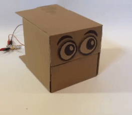
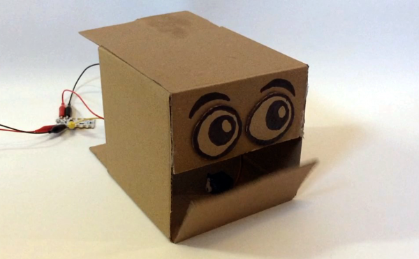

## Open and close sequence

You've got your robot head and you know how to set the servo to make the mouth open and close. Now it's time to code a sequence to make the mouth open and close.

--- task ---

Start with the code that you wrote in 'Finding servo angles'.

--- /task ---

The first section of this code sets the variable values used to tell the servo what angle to rotate to. Then, the second section gives the servo a sequence of rotations and pauses. 

We will keep the first section exactly as it is and just change the sequence.

--- task ---

To begin your sequence, add an `output`{:class="crumbleinputoutput"} block telling the `servo`{:class="crumbleinputoutput"} to make the mouth `close`{:class="crumblevariables"}, and then `wait for 1 second`{:class="crumblecontrol"}.

This is to make the mouth being closed the starting state for the robot head. 

NOTE: All servo movements need to be followed by a `wait`{:class="crumblecontrol"} block to give enough time for the servo to complete its movement. The time might be very quick but some time is always needed.

--- /task ---

--- task ---

Add a repeat loop, `do 10 times`{:class="crumblecontrol"} to the code and change the number of repeats to 3.

--- /task ---

--- task ---

Inside the `repeat`{:class="crumblecontrol"} loop add code to send the `servo`{:class="crumbleinputoutput"} to the `open`{:class="crumblevariables"} position, `wait for 1 second`{:class="crumblecontrol"}, send the `servo`{:class="crumbleinputoutput"} to the `closed`{:class="crumblevariables"} position and then `wait for 1 more second`{:class="crumblecontrol"}.

--- /task ---

--- task ---

Finally, add a `servo A off`{:class="crumbleinputoutput"} block beneath the `repeat`{:class="crumblecontrol"} loop (not inside it) to stop the power to the servo at the end of the code.

Run your code.

--- /task ---

The mouth will open and close three times and then stop.

--- no-print ---

--- /no-print ---

--- print-only ---

--- /print-only ---

The amount of time the servo needs to open and close will vary depending on a range of factors and conditions:
+ The angle of rotation between open and closed
+ The make and model of the servo
+ The condition of the servo
+ The remaining charge in the batteries
+ Any friction in the mechanism

In my example, it was very clear that the delay between the servo movements was much longer than it needed to be.

