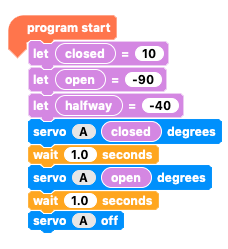
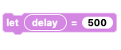
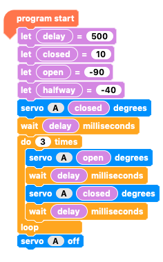

## Open and close sequence

You've got your robot head and you know how to set the servo to make the mouth open and close. Now it's time to code a sequence to make the mouth open and close.

--- task ---

Start with the code that you wrote in 'Find servo angles'.

--- /task ---

The first section of this code sets the variable values, which direct the angle rotation of the servo. Then, the second section gives the servo a sequence of rotations and pauses. 

You will keep the first section exactly as it is and just change the sequence.

--- task ---

To begin your sequence, add an `output`{:class="crumbleinputoutput"} block telling the `servo`{:class="crumbleinputoutput"} to make the mouth `close`{:class="crumblevariables"}, and then `wait for 1 second`{:class="crumblecontrol"}.

This makes the closed mouth the starting state for the robot head. 

NOTE: All servo movements need to be followed by a `wait`{:class="crumblecontrol"} block to give enough time for the servo to complete its movement. 

--- /task ---

--- task ---

Add a repeat loop, `do 10 times`{:class="crumblecontrol"}, to the code and change the number of repeats to 3.

--- /task ---

--- task ---

Inside the `repeat`{:class="crumblecontrol"} loop add code to send the `servo`{:class="crumbleinputoutput"} to the `open`{:class="crumblevariables"} position, `wait for 1 second`{:class="crumblecontrol"}, send the `servo`{:class="crumbleinputoutput"} to the `closed`{:class="crumblevariables"} position and then `wait for 1 more second`{:class="crumblecontrol"}.

--- /task ---

--- task ---

Finally, add a `servo A off`{:class="crumbleinputoutput"} block beneath the `repeat`{:class="crumblecontrol"} loop (not inside it) to stop the power to the servo at the end of the code.

Run your code.

--- /task ---

The mouth will open and close three times and then stop.

--- no-print ---

--- /no-print ---

--- print-only ---

--- /print-only ---

The amount of time the servo needs to open and close will vary depending on a range of factors and conditions:
+ The angle of rotation between open and closed
+ The make and model of the servo
+ The condition of the servo
+ The remaining charge in the batteries
+ Any friction in the mechanism

In my example, it was very clear that the delay between the servo movements was much longer than it needed to be so I am going to shorten the `wait`{:class="crumblecontrol"} time.

Since I have three `wait`{:class="crumblecontrol"} blocks that affect the mouth opening and closing, I need to change all three. Let's make a variable for the `wait`{:class="crumblecontrol"} time to make changing the delay much quicker and easier.

--- task ---

`Add a new variable`{:class="crumblevariables"} called `delay`{:class="crumblevariables"} in the `Variable`{:class="crumblevariables"} palette.

--- /task ---

--- task ---

My robot mouth seemed to spend as much time still as it was moving. To halve the `wait`{:class="crumblecontrol"} time, I set `delay`{:class="crumblevariables"} to `500`{:class="crumblevariables"} so I can make the delay 500 milliseconds.

Add a `let delay = 500`{:class="crumblevariables"} block to the start of your code with the blocks that define your `closed`{:class="crumblevariables"} and `open`{:class="crumblevariables"} variables.

--- /task ---

--- task ---

You will be setting the `wait`{:class="crumblecontrol"} time in milliseconds now, so replace each of the three `wait 0.1 seconds`{:class="crumblecontrol"} blocks with a `wait 100 milliseconds`{:class="crumblecontrol"} block.

Place a `delay`{:class="crumblevariables"} variable block in each `wait 100 milliseconds`{:class="crumblecontrol"} block.

--- /task ---

Let's see what you've done. Time to run your code.

--- no-print ---

--- /no-print ---

--- print-only ---

--- /print-only ---

A `500 milliseconds`{:class="crumblecontrol"} `delay`{:class="crumblevariables"} worked very well and came very close to finding the optimum open and close timing.

To adjust the `wait`{:class="crumblecontrol"} time now you can simply change the `delay`{:class="crumblevariables"} variable value at the start of your code!

I tried 600, 550, 450, 400 and 300 milliseconds. To my surprise, I liked 300 milliseconds the best as it did not let the mouth completely open or close and looked very natural.

--- no-print ---

--- /no-print ---

--- task ---

Now it's your turn to find your favourite timing. Alter the `delay`{:class="crumblevariables"} variable block amount until you find the timing that works best for you.

--- /task ---

