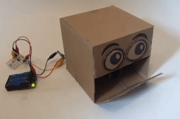
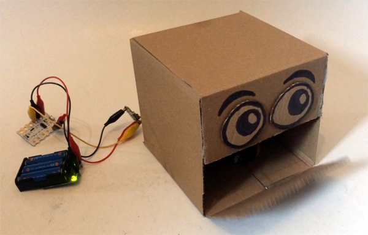
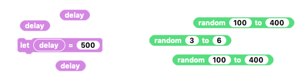
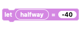
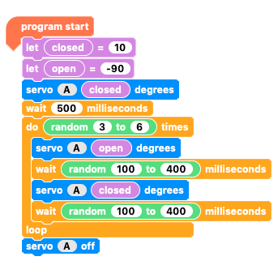

## Challenge: randomise your sequence

You have already coded your robot mouth to open and close but the timing is fixed and the same every time. That's fine for a robot robot, but if you want to make a robot creature or person you might want it to look a little more realistic. Adding a little randomisation is a good way to fo this.

Code your Crumble robot head to open and close just as you have but with a slightly random movement. Let's add a little bonus and have the mouth opening a random number of times too!

Don't start from the beginning, just alter the code you had from the open and close sequence.

NOTE: You could achieve this by randomising the `open`{:class="crumblevariables"} and `closed`{:class="crumblevariables"} variables, but in this case you will randomise the `wait`{:class="crumblecontrol"} time.

--- no-print ---

--- /no-print ---

--- print-only ---

--- /print-only ---

--- hints ---

--- hint ---

When the `program starts`{:class="crumblebasic"}, you should:
+ `Set the closed angle value`{:class="crumblevariables"} and the `open angle value`{:class="crumblevariables"} too
+ Set `servo A`{:class="crumbleinputoutput"} to `closed`{:class="crumblevariables"}
+ `Wait`{:class="crumblecontrol"} for half a second
+ `Repeat`{:class="crumblecontrol"} the mouth open/close sequence `3 to 6`{:class="crumbleoperators"}
+ Set `servo A`{:class="crumbleinputoutput"} to `open`{:class="crumblevariables"}
+ `Wait`{:class="crumblecontrol"} for `100 to 400`{:class="crumbleoperators"} milliseconds
+ Set `servo A`{:class="crumbleinputoutput"} to `closed`{:class="crumblevariables"}
+ `Wait`{:class="crumblecontrol"} for another `100 to 400`{:class="crumbleoperators"} milliseconds
+ Finally, after the `repeat loop`{:class="crumblecontrol"}, turn `servo A OFF`{:class="crumbleinputoutput"}

Most of the code is the same as before. You will need to remove some `variable`{:class="crumblevariables"} blocks and add a few `random number`{:class="crumbleoperators"} blocks.

--- /hint ---

--- hint ---

You will need to remove the `delay variable`{:class="crumblevariables"} blocks and add the `random number`{:class="crumbleoperators"} blocks.

I have also removed the `halfway variable`{:class="crumblevariables"} block as it wasn't doing anything. It does no harm but there's no reason to have it until we start using it.

--- /hint ---

--- hint ---

The code below works for my robot head's mouth. You will probably have different `open`{:class="crumblevariables"} and `closed`{:class="crumblevariables"} angles. The range of `random numbers`{:class="crumbleoperators"} you choose for your robot is also dependent on your robot and your choice.

Click the green **Play** button to see if it works.

--- /hint ---

--- /hints ---