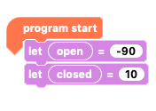
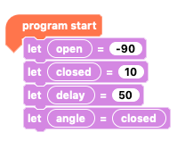
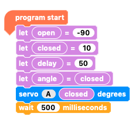
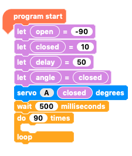
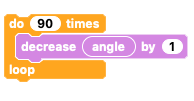
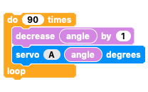
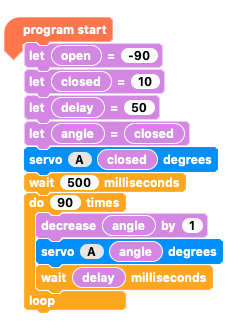
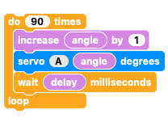
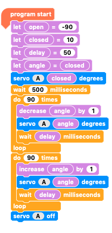
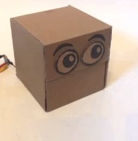

## Slow moves

Up until now you have been coding your servo to move from one angle to another as fast as it can go.

**Go here!... Now go here!... Now here!**

You can't actually control the speed of the servo using your Crumble controller but you can come very close by making the `servo move`{:class="crumbleinputoutput"} in little steps with tiny `pauses`{:class="crumblecontrol"} between each step.

--- task ---

Start by getting the `program start`{:class="crumblebasic"} block and then setting the `open`{:class="crumblevariables"} and `closed`{:class="crumblevariables"} variables to the values needed for your own robot head.

--- /task ---

--- task ---

Next, add two new variables called `delay`{:class="crumblevariables"} and `angle`{:class="crumblevariables"}.

Set `delay`{:class="crumblevariables"} to `50`{:class="crumblevariables"} and `angle`{:class="crumblevariables"} to `closed`{:class="crumblevariables"}.

--- /task ---

`Open`{:class="crumblevariables"} and `closed`{:class="crumblevariables"} you have used before and know that they are used to specify the angle at which the mouth is fully open and fully closed.

`Delay`{:class="crumblevariables"} means the amount of milliseconds between each small step that the servo makes of its overall rotation.

`Angle`{:class="crumblevariables"} refers to the variable used to tell the servo what angle to move to next. `Angle`{:class="crumblevariables"} starts as `closed`{:class="crumblevariables"}, which in my example robot is 10°, but keep increasing (or decreasing) to make the servo move to the next small step. As the `angle`{:class="crumblevariables"} variable changes, your servo's rotation position changes too.

--- task ---

Close the mouth by setting `servo A`{:class="crumbleinputoutput"} to `closed`{:class="crumblevariables"}, then `wait`{:class="crumblecontrol"} for 500 milliseconds.

Next, add two new variables called `delay`{:class="crumblevariables"} and `angle`{:class="crumblevariables"}.

--- /task ---

The next step is to create a `repeat loop`{:class="crumblecontrol"} to change the `angle`{:class="crumblevariables"} variable, move the `servo`{:class="crumbleinputoutput"} to the new `angle`{:class="crumblevariables"} and `wait`{:class="crumblecontrol"} a moment before the next small change of `angle`{:class="crumblevariables"}.

--- task ---

Get a `repeat loop`{:class="crumblecontrol"} and set it to repeat 90 times.

The 90 is move the mouth by ninety times by 1°, which means opening and closing the mouth by 90°. This can be changed to suit your project.

--- /task ---

--- task ---

Inside the `repeat loop`{:class="crumblecontrol"}, add a variable block to `decrease angle by 1`{:class="crumblevariables"}.

NOTE: Since the example robot mouth is `closed`{:class="crumblevariables"} at 10° and `open`{:class="crumblevariables"} at -90°, `angle`{:class="crumblevariables"} must **decrease** to move from closed to open. You need to look at your own project to see if `angle`{:class="crumblevariables"} must decrease or increase at this point.

--- /task ---

--- task ---

Set `servo A`{:class="crumbleinputoutput"} to `angle`{:class="crumblevariables"}.

Inside the `repeat loop`{:class="crumblecontrol"}, add a variable block to `decrease angle by 1`{:class="crumblevariables"}.

--- /task ---

--- task ---

`Wait`{:class="crumblecontrol"} for `delay`{:class="crumblevariables"} milliseconds.

--- /task ---

So, that is the first `loop`{:class="crumblecontrol"} done. `Angle`{:class="crumblevariables"} has decreased 90 times by 1° each time.

Now it's time to reverse the loop and increase `angle`{:class="crumblevariables"} unitl the mouth is closed again.

--- task ---

Duplicate the whole `repeat loop`{:class="crumblecontrol"} and the code inside it.

Replace the `decrease angle by 1`{:class="crumblevariables"} with an `increase angle by 1`{:class="crumblevariables"} block.

--- /task ---

The rest of the `repeat loop`{:class="crumblecontrol"} remains unchanged.

--- task ---

Finally, add a block to turn the `servo OFF`{:class="crumbleinputoutput"}.

--- /task ---

Click the **play** button to run the code.

--- no-print ---

--- /no-print ---

--- task ---

Adjust the `delay`{:class="crumblevariables"} variable to control the speed. See what difference it makes when you increase or decrease the value.

You could try randomising the `delay`{:class="crumblevariables"} variable to get a random opening and closing speed. 

--- /task ---
